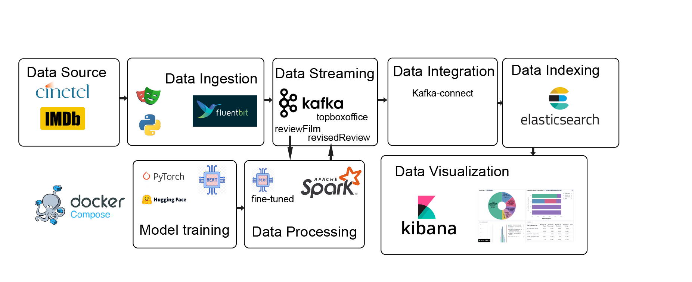

# 🎬 CineData

> *«Che film scelgo?»* 

**CineData** è una piattaforma di analisi cinematografica in tempo reale pensata per cinefili, giornalisti cinematografici e direttori di sala che vogliono andare oltre il semplice voto e capire davvero cosa rende un film memorabile.

Raccoglie automaticamente i top10 film più visti al cinema italiano (Box Office Cinetel) e le relative recensioni da IMDb, le arricchisce con un'analisi degli aspetti cinematografici tramite un modello BERT fine-tunato, e le rende esplorabili attraverso dashboard interattive su Kibana.

Se lo si desidera è possibile scegliere personalmente un film da analizzare.

---

## 🎯 A chi serve

- **Cinefili** — scopri quali film eccellono per regia, fotografia, storia o emozioni, non solo per il botteghino
- **Giornalisti cinematografici** — dati aggregati e tendenze in tempo reale per supportare articoli e recensioni
- **Direttori di sala** — analisi del sentiment del pubblico e sui film più proficui per orientare le scelte di visione

---

## 🏗️ Struttura



| Layer | Tecnologia | Ruolo |
|-------|-----------|-------|
| Data Source | Cinetel, IMDb | Fonti dati |
| Data Ingestion | Python, Fluent Bit | Web scraping + forwarding a Kafka |
| Data Streaming | Apache Kafka | Trasporto messaggi in tempo reale |
| Model Training | BERT, HuggingFace, PyTorch | Fine-tuning offline su recensioni IMDB annotate |
| Data Processing | Apache Spark + BERT | Enrichment delle recensioni con predizioni ML |
| Data Integration | Kafka Connect | Sink da Kafka a Elasticsearch |
| Data Indexing | Elasticsearch | Indicizzazione e storage |
| Data Visualization | Kibana | Dashboard interattive |
| Infrastruttura | Docker Compose | Orchestrazione di tutti i servizi |

---

## 🤖 Il Modello BERT

Il cuore del progetto è un modello **BERT fine-tunato per regressione multi-output** sul dataset [Lowerated/imdb-reviews-rated](https://huggingface.co/datasets/Lowerated/imdb-reviews-rated).

Dato il testo di una recensione, predice 7 score continui:

| Aspetto | Descrizione |
|---------|-------------|
| `direction` | Qualità della regia |
| `cinematography` | Qualità della fotografia |
| `unique_concept` | Originalità del concept |
| `story` | Qualità della sceneggiatura |
| `emotions` | Impatto emotivo |
| `characters` | Profondità dei personaggi |
| `production_design` | Qualità della produzione |

Ogni recensione raccolta viene arricchita da questi score e resa disponibile su Kibana per analisi aggregate per film, genere e distribuzione geografica.

---

## 🚀 Avvio rapido

### Prerequisiti

- Docker e Docker Compose installati
- Il modello BERT fine-tunato nella cartella `models/cinedata_bert_film/`, guarda il README.md in `training/`

### Avvia l'intera pipeline

```bash
# Rapidamente
chmod +x start.sh
./start.sh

# Oppure avvia tutti i servizi
docker compose --profile all up -d

```

### Successivamente avvia lo scraping

```bash
docker compose --profile scraping up
```

#### Puoi inserire tu un film da cercare con l'id di IMDb e un titolo a tua scelta
```bash
    docker compose run --rm scraping python main_scraper.py --demo tt0133093  --title "The Matrix" --max-reviews 20
```

### Importa le dashboard Kibana

vai su **Kibana → Stack Management → Saved Objects → Import** e carica il file `scripts/kibana-export.ndjson` incluso nel repository.

---

## 📁 Struttura del progetto

```
CineData/
├── WebScraping/          # Scraper Python per Cinetel e IMDb
├── fluentbit/            # Configurazione Fluent Bit
├── models/
│   ├── script/           # Script Spark per inferenza BERT
│   └── cinedata_bert_film/  # Modello fine-tunato (non incluso nel repo)
├── training/             # Script di fine-tuning BERT
├── elasticsearch/        # Configurazioni Elasticsearch
├── scripts/              # Script di inizializzazione connettori Kafka
    └── kibana-export.ndjson  # Dashboard e Data Views preconfigurate
├── docker-compose.yml    # Orchestrazione servizi
├── start.sh              # Script di avvio
```

---

## 🔧 Servizi e porte

| Servizio | Porta | Descrizione |
|---------|-------|-------------|
| Kafka | 9092 | Broker Kafka |
| Kafka Connect | 8083 | REST API connettori |
| Elasticsearch | 9200 | REST API indici |
| Kibana | 5601 | Dashboard |

---

## 📊 Topic Kafka

| Topic | Contenuto |
|-------|-----------|
| `topboxoffice` | Dati box office da Cinetel (posizione, incassi, presenze) |
| `reviewFilm` | Recensioni grezze da IMDb |
| `revisedReview` | Recensioni arricchite con predizioni BERT |

---

## 🎓 Contesto accademico

Progetto sviluppato per il corso **TAP (Technologies for Advanced Programming) 2025/2026**
Dipartimento di Matematica e Informatica — Università degli Studi di Catania


## Comandi utili

Visualizzare che kafka-connect sia stato creato correttamente
```

curl -s http://localhost:8083/connectors      
```

se non vi è es-sink-multi: 

```
docker compose --profile clk up
```


Controllare che spark sia attivo

```
docker logs -f spark-sentiment       
```

altrimennti 
```
docker compose --profile sparkText --profile kafka up
```

